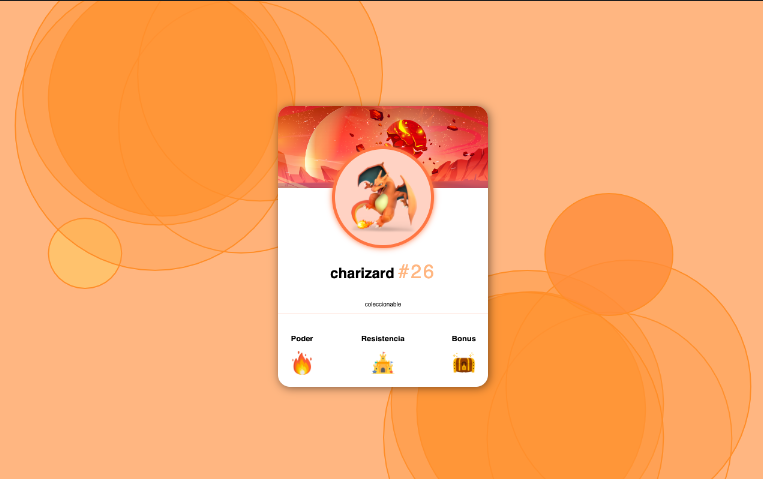
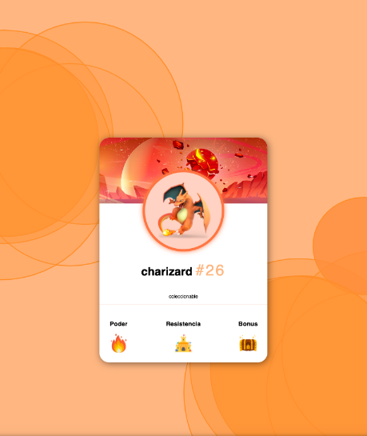
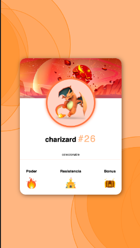

# Pokemon Card
A simple Pokemon Card Responsive

## Technologies
- HTML5
- CSS
- SASS
- Responsive
- Mobile First

## Figma background design

=> https://www.figma.com/file/n0EeTL0EvRQeFSze7UVqyQ/Background-Image?node-id=0%3A1&t=b33xcNXFin3RfWeL-1

## Demo
If you want to see the demo of this proyect deployed, you can visit [Pokemon Card](https://idev-pokemon-card-html-sass.netlify.app/)

## Preview
#
#### Laptop

#
#### iPad

#
#### Mobile

